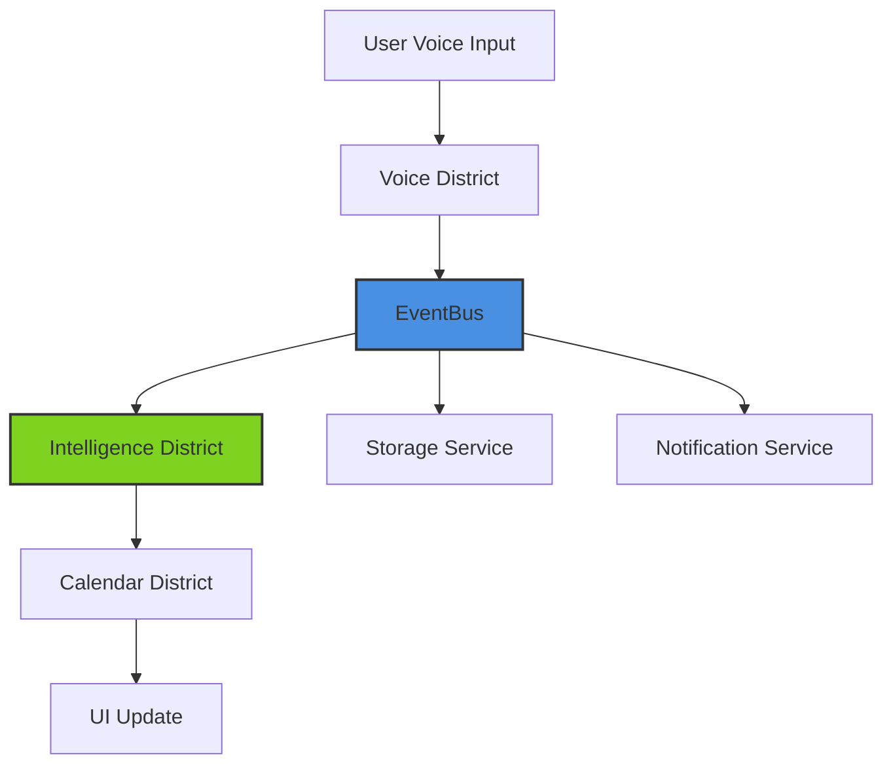

# ADHD Voice Assistant - Complete Technical Architecture

## Table of Contents

1. [Executive Summary](#executive-summary)
1. [System Architecture Overview](#system-architecture-overview)
1. [Core Architecture Patterns](#core-architecture-patterns)
1. [Technology Stack](#technology-stack)
1. [Module Architecture](#module-architecture)
1. [Data Architecture](#data-architecture)
1. [Security Architecture](#security-architecture)
1. [Integration Architecture](#integration-architecture)
1. [Accessibility Architecture](#accessibility-architecture)
1. [Performance Architecture](#performance-architecture)
1. [Deployment Architecture](#deployment-architecture)
1. [Testing Architecture](#testing-architecture)
1. [Monitoring & Analytics](#monitoring--analytics)
1. [Future Considerations](#future-considerations)

-----

## Executive Summary

The ADHD Voice Assistant is a voice-first iOS application designed specifically for individuals with ADHD to capture racing thoughts and manage multiple calendars efficiently. Built on iOS 17+ with SwiftUI and an EventBus architecture, it prioritizes accessibility, privacy, and ADHD-specific user experience patterns.

### Key Technical Decisions

- **Platform**: iOS 17+ (leveraging enhanced SFSpeechRecognizer)
- **Architecture**: EventBus pattern for ADHD-optimized state management
- **UI Framework**: SwiftUI with full accessibility support
- **Storage**: Core Data + CloudKit for sync
- **Privacy**: On-device processing where possible
- **Calendar Integration**: Universal adapter pattern for multi-provider support

### Core Principles

- **Immediate Value**: No complex setup, value within 60 seconds
- **ADHD-First Design**: Every decision optimized for ADHD brains
- **Accessibility Native**: Built-in from ground up, not retrofitted
- **Privacy Focused**: Local processing, minimal data collection
- **Performance Optimized**: Instant response for maintaining focus

-----

## System Architecture Overview

```
┌─────────────────────────────────────────────────────────────┐
│                    User Interface Layer                      │
│                  SwiftUI + Accessibility                     │
├─────────────────────────────────────────────────────────────┤
│                    EventBus Architecture                     │
│              Central Nervous System for ADHD                 │
├─────────────────────────────────────────────────────────────┤
│                      Feature Districts                       │
│     Voice │ Calendar │ Intelligence │ Accessibility         │
├─────────────────────────────────────────────────────────────┤
│                      Core Services                           │
│   Storage │ Auth │ Network │ Speech │ Calendar APIs         │
├─────────────────────────────────────────────────────────────┤
│                    iOS System Services                       │
│   SFSpeechRecognizer │ EventKit │ Core Data │ CloudKit     │
└─────────────────────────────────────────────────────────────┘
```

### Component Interaction Flow



-----

## Core Architecture Patterns

### 1. EventBus Pattern (ADHD-Optimized)

The EventBus serves as the application’s central nervous system, designed to mirror ADHD thought patterns:

```swift
// Core/EventBus/ADHDEventBus.swift
import Foundation
import Combine

final class ADHDEventBus {
    static let shared = ADHDEventBus()
    
    private let eventSubject = PassthroughSubject<ADHDEvent, Never>()
    private var subscriptions = Set<AnyCancellable>()
    
    // Priority queue for ADHD urgency handling
    private let priorityQueue = DispatchQueue(
        label: "com.adhd.eventbus.priority",
        qos: .userInitiated
    )
    
    // Publish events with ADHD-aware prioritization
    func publish(_ event: ADHDEvent) {
        priorityQueue.async { [weak self] in
            self?.eventSubject.send(event)
            self?.logEventForPatternDetection(event)
        }
    }
    
    // Subscribe to specific event types
    func subscribe<T: ADHDEvent>(
        to eventType: T.Type,
        priority: ADHDPriority = .normal,
        handler: @escaping (T) -> Void
    ) -> AnyCancellable {
        return eventSubject
            .compactMap { $0 as? T }
            .receive(on: priorityQueue(for: priority))
            .sink { event in
                handler(event)
            }
    }
    
    private func priorityQueue(for priority: ADHDPriority) -> DispatchQueue {
        switch priority {
        case .urgent:
            return DispatchQueue.main // Immediate UI updates
        case .high:
            return DispatchQueue.global(qos: .userInitiated)
        case .normal:
            return DispatchQueue.global(qos: .default)
        case .low:
            return DispatchQueue.global(qos: .background)
        }
    }
    
    private func logEventForPatternDetection(_ event: ADHDEvent) {
        // Store event for pattern analysis
        PatternDetectionService.shared.recordEvent(event)
    }
}

// Event Protocol
protocol ADHDEvent {
    var id: UUID { get }
    var timestamp: Date { get }
    var priority: ADHDPriority { get }
    var category: EventCategory { get }
}

enum ADHDPriority {
    case urgent  // Immediate attention needed
    case high    // Important but not immediate
    case normal  // Regular processing
    case low     // Background tasks
}

enum EventCategory {
    case voice
    case calendar
    case intelligence
    case accessibility
    case celebration
}
```

### 2. District Pattern (Feature Isolation)

Each major feature area is organized as a “District” - a self-contained module that communicates via EventBus:

```swift
// Core/Districts/District.swift
protocol District {
    var name: String { get }
    func initialize()
    func handleEvent(_ event: ADHDEvent)
    func shutdown()
}

// Features/Voice/VoiceDistrict.swift
final class VoiceDistrict: District {
    let name = "Voice"
    private var subscriptions = Set<AnyCancellable>()
    private let speechRecognizer: SpeechRecognitionService
    private let transcriptionService: TranscriptionService
    
    init() {
        self.speechRecognizer = SpeechRecognitionService()
        self.transcriptionService = TranscriptionService()
    }
    
    func initialize() {
        // Subscribe to relevant events
        ADHDEventBus.shared.subscribe(to: VoiceCaptureRequestedEvent.self) { [weak self] event in
            self?.startVoiceCapture(for: event)
        }
        
        ADHDEventBus.shared.subscribe(to: AppBecameActiveEvent.self) { [weak self] _ in
            self?.prepareSpeechRecognition()
        }
    }
    
    private func startVoiceCapture(for event: VoiceCaptureRequestedEvent) {
        Task {
            do {
                let transcription = try await speechRecognizer.startRecording()
                
                // Publish completion event
                ADHDEventBus.shared.publish(
                    VoiceCaptureCompletedEvent(
                        transcription: transcription,
                        duration: transcription.duration,
                        confidence: transcription.confidence
                    )
                )
                
                // Trigger celebration for successful capture
                if transcription.confidence > 0.8 {
                    ADHDEventBus.shared.publish(
                        CelebrationEvent(type: .thoughtCaptured)
                    )
                }
            } catch {
                ADHDEventBus.shared.publish(
                    ErrorEvent(
                        source: .voice,
                        error: error,
                        userMessage: "Let's try that again - no worries!"
                    )
                )
            }
        }
    }
    
    func handleEvent(_ event: ADHDEvent) {
        // Handle events specific to voice district
    }
    
    func shutdown() {
        subscriptions.forEach { $0.cancel() }
        speechRecognizer.cleanup()
    }
}
```

### 3. Event Types

```swift
// Core/EventBus/Events/VoiceEvents.swift
struct VoiceCaptureRequestedEvent: ADHDEvent {
    let id = UUID()
    let timestamp = Date()
    let priority: ADHDPriority = .urgent
    let category: EventCategory = .voice
    let source: VoiceCaptureSource
}

struct VoiceCaptureCompletedEvent: ADHDEvent {
    let id = UUID()
    let timestamp = Date()
    let priority: ADHDPriority = .high
    let category: EventCategory = .voice
    let transcription: Transcription
    let duration: TimeInterval
    let confidence: Float
}

// Core/EventBus/Events/CalendarEvents.swift
struct CalendarEventSuggestedEvent: ADHDEvent {
    let id = UUID()
    let timestamp = Date()
    let priority: ADHDPriority = .normal
    let category: EventCategory = .calendar
    let suggestion: CalendarSuggestion
    let sourceThought: Thought
}

struct CalendarConflictDetectedEvent: ADHDEvent {
    let id = UUID()
    let timestamp = Date()
    let priority: ADHDPriority = .high
    let category: EventCategory = .calendar
    let conflicts: [CalendarConflict]
}

// Core/EventBus/Events/IntelligenceEvents.swift
struct ADHDPatternDetectedEvent: ADHDEvent {
    let id = UUID()
    let timestamp = Date()
    let priority: ADHDPriority = .normal
    let category: EventCategory = .intelligence
    let pattern: ADHDPattern
    let confidence: Float
    let suggestion: String?
}

// Core/EventBus/Events/CelebrationEvents.swift
struct CelebrationEvent: ADHDEvent {
    let id = UUID()
    let timestamp = Date()
    let priority: ADHDPriority = .high
    let category: EventCategory = .celebration
    let type: CelebrationType
    
    enum CelebrationType {
        case thoughtCaptured
        case eventCreated
        case conflictAvoided
        case weeklyGoalMet
    }
}
```

-----

## Technology Stack

### Core Technologies

|Layer           |Technology        |Version|Purpose                    |
|----------------|------------------|-------|---------------------------|
|**Platform**    |iOS               |17.0+  |Enhanced speech recognition|
|**Language**    |Swift             |5.9+   |Modern, safe, performant   |
|**UI Framework**|SwiftUI           |5.0    |Declarative, accessible UI |
|**Concurrency** |Swift Concurrency |Latest |async/await patterns       |
|**Storage**     |Core Data         |Latest |Local data persistence     |
|**Sync**        |CloudKit          |Latest |Cross-device sync          |
|**Speech**      |SFSpeechRecognizer|iOS 17 |Enhanced accuracy          |
|**Calendar**    |EventKit          |Latest |Apple Calendar access      |

### Third-Party SDKs

|SDK                   |Version|Purpose             |License   |
|----------------------|-------|--------------------|----------|
|**Google Sign-In**    |7.0+   |Google Calendar auth|Apache 2.0|
|**Google APIs Client**|4.0+   |Calendar API access |Apache 2.0|
|**MSAL iOS**          |1.2+   |Microsoft auth      |MIT       |
|**Microsoft Graph**   |2.0+   |Outlook calendar    |MIT       |

### Development Tools

|Tool                     |Purpose              |
|-------------------------|---------------------|
|**Xcode**                |IDE and build system |
|**Swift Package Manager**|Dependency management|
|**XCTest**               |Unit and UI testing  |
|**Instruments**          |Performance profiling|
|**TestFlight**           |Beta distribution    |

-----

## Module Architecture

### Project Structure

```
ADHDVoiceAssistant/
├── App/
│   ├── ADHDVoiceAssistantApp.swift
│   ├── AppDelegate.swift
│   ├── Info.plist
│   └── Resources/
│       ├── Assets.xcassets
│       ├── Localizable.strings
│       └── GoogleService-Info.plist
│
├── Core/
│   ├── EventBus/
│   │   ├── ADHDEventBus.swift
│   │   ├── Events/
│   │   │   ├── VoiceEvents.swift
│   │   │   ├── CalendarEvents.swift
│   │   │   ├── IntelligenceEvents.swift
│   │   │   └── AccessibilityEvents.swift
│   │   └── Districts/
│   │       └── District.swift
│   │
│   ├── Models/
│   │   ├── Thought.swift
│   │   ├── CalendarEvent.swift
│   │   ├── ADHDPattern.swift
│   │   └── UserPreferences.swift
│   │
│   ├── Storage/
│   │   ├── CoreDataStack.swift
│   │   ├── ADHDVoiceAssistant.xcdatamodeld
│   │   ├── CloudKitManager.swift
│   │   └── Migrations/
│   │
│   ├── Services/
│   │   ├── AuthenticationService.swift
│   │   ├── NetworkService.swift
│   │   ├── NotificationService.swift
│   │   └── AnalyticsService.swift
│   │
│   └── Extensions/
│       ├── Date+ADHD.swift
│       ├── String+Accessibility.swift
│       └── View+ADHDStyle.swift
│
├── Features/
│   ├── Voice/
│   │   ├── VoiceDistrict.swift
│   │   ├── Services/
│   │   │   ├── SpeechRecognitionService.swift
│   │   │   ├── TranscriptionService.swift
│   │   │   └── AudioSessionManager.swift
│   │   ├── Models/
│   │   │   ├── Transcription.swift
│   │   │   └── VoiceCommand.swift
│   │   └── Views/
│   │       ├── VoiceCaptureView.swift
│   │       ├── TranscriptionView.swift
│   │       └── VoiceSettingsView.swift
│   │
│   ├── Calendar/
│   │   ├── CalendarDistrict.swift
│   │   ├── Services/
│   │   │   ├── UniversalCalendarManager.swift
│   │   │   ├── Providers/
│   │   │   │   ├── AppleCalendarProvider.swift
│   │   │   │   ├── GoogleCalendarProvider.swift
│   │   │   │   └── MicrosoftCalendarProvider.swift
│   │   │   ├── ConflictDetector.swift
│   │   │   └── EventCreationService.swift
│   │   ├── Models/
│   │   │   ├── UnifiedCalendarEvent.swift
│   │   │   ├── CalendarProvider.swift
│   │   │   └── ConflictInfo.swift
│   │   └── Views/
│   │       ├── UnifiedCalendarView.swift
│   │       ├── EventCreationView.swift
│   │       └── CalendarSettingsView.swift
│   │
│   ├── Intelligence/
│   │   ├── IntelligenceDistrict.swift
│   │   ├── Services/
│   │   │   ├── PatternDetectionService.swift
│   │   │   ├── ADHDInsightsEngine.swift
│   │   │   ├── SmartScheduler.swift
│   │   │   └── EnergyTracker.swift
│   │   ├── Models/
│   │   │   ├── ADHDPattern.swift
│   │   │   ├── EnergyLevel.swift
│   │   │   └── SchedulingSuggestion.swift
│   │   └── Views/
│   │       ├── InsightsDashboard.swift
│   │       ├── PatternVisualization.swift
│   │       └── EnergyTrackerView.swift
│   │
│   └── Accessibility/
│       ├── AccessibilityDistrict.swift
│       ├── Services/
│       │   ├── VoiceOverService.swift
│       │   ├── VoiceControlService.swift
│       │   └── CognitiveAccessibilityService.swift
│       ├── Components/
│       │   ├── AccessibleButton.swift
│       │   ├── AccessibleTextField.swift
│       │   └── AccessibleCalendar.swift
│       └── Modifiers/
│           ├── ADHDAccessibility.swift
│           └── CognitiveLoad.swift
│
├── UI/
│   ├── Theme/
│   │   ├── ADHDColors.swift
│   │   ├── ADHDTypography.swift
│   │   └── ADHDSpacing.swift
│   ├── Components/
│   │   ├── ADHDButton.swift
│   │   ├── ThoughtBubble.swift
│   │   ├── CalendarCard.swift
│   │   └── CelebrationView.swift
│   └── Screens/
│       ├── MainView.swift
│       ├── OnboardingFlow/
│       ├── SettingsView.swift
│       └── AboutView.swift
│
└── Tests/
    ├── UnitTests/
    ├── IntegrationTests/
    ├── UITests/
    └── AccessibilityTests/
```

-----

## Data Architecture

### Core Data Schema

```swift
// Core Data Entities

// Thought Entity
@objc(Thought)
public class Thought: NSManagedObject {
    @NSManaged public var id: UUID
    @NSManaged public var transcription: String
    @NSManaged public var createdAt: Date
    @NSManaged public var duration: Double
    @NSManaged public var confidence: Float
    @NSManaged public var category: String?
    @NSManaged public var tags: Set<Tag>
    @NSManaged public var calendarEvent: CalendarEvent?
    @NSManaged public var audioFileURL: String?
    @NSManaged public var domain: String // work, personal, health, etc.
    @NSManaged public var priority: Int16
    @NSManaged public var isProcessed: Bool
}

// CalendarEvent Entity
@objc(CalendarEvent)
public class CalendarEvent: NSManagedObject {
    @NSManaged public var id: UUID
    @NSManaged public var title: String
    @NSManaged public var startDate: Date
    @NSManaged public var endDate: Date
    @NSManaged public var calendarProvider: String
    @NSManaged public var calendarIdentifier: String
    @NSManaged public var externalIdentifier: String?
    @NSManaged public var location: String?
    @NSManaged public var notes: String?
    @NSManaged public var reminderMinutes: Int16
    @NSManaged public var bufferMinutes: Int16 // ADHD buffer time
    @NSManaged public var thought: Thought?
    @NSManaged public var conflicts: Set<ConflictRecord>
}

// ADHDPattern Entity
@objc(ADHDPattern)
public class ADHDPattern: NSManagedObject {
    @NSManaged public var id: UUID
    @NSManaged public var type: String
    @NSManaged public var detectedAt: Date
    @NSManaged public var confidence: Float
    @NSManaged public var frequency: Int32
    @NSManaged public var timeOfDay: String?
    @NSManaged public var dayOfWeek: String?
    @NSManaged public var associatedThoughts: Set<Thought>
    @NSManaged public var suggestedAction: String?
}

// UserPreference Entity
@objc(UserPreference)
public class UserPreference: NSManagedObject {
    @NSManaged public var key: String
    @NSManaged public var value: Data
    @NSManaged public var category: String
    @NSManaged public var lastModified: Date
}

// ConflictRecord Entity
@objc(ConflictRecord)
public class ConflictRecord: NSManagedObject {
    @NSManaged public var id: UUID
    @NSManaged public var detectedAt: Date
    @NSManaged public var conflictingEvents: Set<CalendarEvent>
    @NSManaged public var resolutionSuggestion: String?
    @NSManaged public var wasResolved: Bool
}
```

### CloudKit Schema

```swift
// CloudKit Record Types

struct CKThought {
    static let recordType = "Thought"
    
    enum Fields: String {
        case transcription
        case createdAt
        case category
        case domain
        case priority
        case tags
    }
}

struct CKCalendarEvent {
    static let recordType = "CalendarEvent"
    
    enum Fields: String {
        case title
        case startDate
        case endDate
        case provider
        case calendarID
        case bufferMinutes
    }
}

struct CKADHDPattern {
    static let recordType = "ADHDPattern"
    
    enum Fields: String {
        case type
        case confidence
        case frequency
        case timePattern
        case suggestion
    }
}
```

### Core Data Stack Implementation

```swift
// Core/Storage/CoreDataStack.swift
import CoreData
import CloudKit

final class CoreDataStack {
    static let shared = CoreDataStack()
    
    lazy var persistentContainer: NSPersistentCloudKitContainer = {
        let container = NSPersistentCloudKitContainer(name: "ADHDVoiceAssistant")
        
        // Configure for CloudKit sync
        let storeDescription = container.persistentStoreDescriptions.first
        storeDescription?.setOption(true as NSNumber, 
                                   forKey: NSPersistentHistoryTrackingKey)
        storeDescription?.setOption(true as NSNumber, 
                                   forKey: NSPersistentStoreRemoteChangeNotificationPostOptionKey)
        
        container.loadPersistentStores { _, error in
            if let error = error {
                // Handle error appropriately for production
                fatalError("Core Data failed to load: \(error)")
            }
        }
        
        container.viewContext.automaticallyMergesChangesFromParent = true
        
        return container
    }()
    
    func save() async throws {
        let context = persistentContainer.viewContext
        
        guard context.hasChanges else { return }
        
        try await context.perform {
            try context.save()
        }
    }
    
    func fetchRecentThoughts(limit: Int = 100) async throws -> [Thought] {
        let context = persistentContainer.viewContext
        let request = Thought.fetchRequest()
        request.sortDescriptors = [NSSortDescriptor(key: "createdAt", ascending: false)]
        request.fetchLimit = limit
        
        return try await context.perform {
            try context.fetch(request)
        }
    }
}
```

-----

## Security Architecture

### Authentication & Authorization

```swift
// Core/Security/AuthenticationManager.swift
import LocalAuthentication
import GoogleSignIn
import MSAL

final class AuthenticationManager {
    private let keychain = KeychainService()
    
    // OAuth 2.0 flows for calendar providers
    func authenticateGoogle() async throws -> GoogleCredentials {
        guard let presentingViewController = await UIApplication.shared.topViewController() else {
            throw AuthError.noPresentingViewController
        }
        
        return try await withCheckedThrowingContinuation { continuation in
            GIDSignIn.sharedInstance.signIn(
                withPresenting: presentingViewController
            ) { result, error in
                if let error = error {
                    continuation.resume(throwing: error)
                } else if let result = result {
                    let credentials = GoogleCredentials(
                        accessToken: result.user.accessToken.tokenString,
                        refreshToken: result.user.refreshToken.tokenString,
                        expiresAt: result.user.accessToken.expirationDate
                    )
                    continuation.resume(returning: credentials)
                }
            }
        }
    }
    
    func authenticateMicrosoft() async throws -> MSALCredentials {
        let config = MSALPublicClientApplicationConfig(
            clientId: Configuration.microsoftClientId
        )
        let application = try MSALPublicClientApplication(configuration: config)
        
        let webviewParameters = MSALWebviewParameters(
            authPresentationViewController: await UIApplication.shared.topViewController()
        )
        let interactiveParameters = MSALInteractiveTokenParameters(
            scopes: ["https://graph.microsoft.com/calendars.readwrite"],
            webviewParameters: webviewParameters
        )
        
        let result = try await application.acquireToken(with: interactiveParameters)
        
        return MSALCredentials(
            accessToken: result.accessToken,
            expiresOn: result.expiresOn,
            account: result.account
        )
    }
    
    // Biometric authentication for app access
    func authenticateWithBiometrics() async throws -> Bool {
        let context = LAContext()
        var error: NSError?
        
        guard context.canEvaluatePolicy(
            .deviceOwnerAuthenticationWithBiometrics, 
            error: &error
        ) else {
            throw AuthError.biometricsNotAvailable
        }
        
        return try await context.evaluatePolicy(
            .deviceOwnerAuthenticationWithBiometrics,
            localizedReason: "Access your thoughts securely"
        )
    }
}

// Keychain storage for sensitive data
final class KeychainService {
    private let service = "com.creativelightllc.adhd.voice"
    
    func store(credentials: Credentials, for provider: CalendarProvider) throws {
        let data = try JSONEncoder().encode(credentials)
        
        let query: [String: Any] = [
            kSecClass as String: kSecClassGenericPassword,
            kSecAttrService as String: service,
            kSecAttrAccount as String: provider.rawValue,
            kSecValueData as String: data
        ]
        
        SecItemDelete(query as CFDictionary)
        
        let status = SecItemAdd(query as CFDictionary, nil)
        guard status == errSecSuccess else {
            throw KeychainError.storeFailed(status)
        }
    }
    
    func retrieve(for provider: CalendarProvider) throws -> Credentials? {
        let query: [String: Any] = [
            kSecClass as String: kSecClassGenericPassword,
            kSecAttrService as String: service,
            kSecAttrAccount as String: provider.rawValue,
            kSecReturnData as String: true
        ]
        
        var result: AnyObject?
        let status = SecItemCopyMatching(query as CFDictionary, &result)
        
        guard status == errSecSuccess,
              let data = result as? Data else {
            return nil
        }
        
        return try JSONDecoder().decode(Credentials.self, from: data)
    }
}
```

### Data Encryption

```swift
// Core/Security/EncryptionService.swift
import CryptoKit

final class EncryptionService {
    private let key: SymmetricKey
    
    init() throws {
        // Generate or retrieve encryption key from Keychain
        if let existingKey = try? KeychainService().retrieveEncryptionKey() {
            self.key = existingKey
        } else {
            self.key = SymmetricKey(size: .bits256)
            try KeychainService().storeEncryptionKey(key)
        }
    }
    
    func encrypt(_ data: Data) throws -> Data {
        let sealedBox = try AES.GCM.seal(data, using: key)
        return sealedBox.combined ?? Data()
    }
    
    func decrypt(_ data: Data) throws -> Data {
        let sealedBox = try AES.GCM.SealedBox(combined: data)
        return try AES.GCM.open(sealedBox, using: key)
    }
}

// Extension for encrypting sensitive Thought data
extension Thought {
    func encryptSensitiveData() throws {
        let encryptionService = try EncryptionService()
        
        if let transcriptionData = transcription.data(using: .utf8) {
            let encrypted = try encryptionService.encrypt(transcriptionData)
            self.encryptedTranscription = encrypted
            self.transcription = "" // Clear plain text
        }
    }
    
    func decryptSensitiveData() throws -> String {
        let encryptionService = try EncryptionService()
        
        guard let encryptedData = self.encryptedTranscription else {
            return self.transcription
        }
        
        let decrypted = try encryptionService.decrypt(encryptedData)
        return String(data: decrypted, encoding: .utf8) ?? ""
    }
}
```

### Privacy Controls

```swift
// Core/Security/PrivacySettings.swift
struct PrivacySettings: Codable {
    // Local processing by default
    var preferLocalProcessing = true
    
    // Minimal data collection
    var allowAnalytics = false
    
    // Clear data retention policies
    var thoughtRetentionDays = 365
    var autoDeleteOldThoughts = true
    
    // Explicit consent for each calendar
    var calendarPermissions: [CalendarProvider: Bool] = [:]
    
    // Voice recording settings
    var deleteAudioAfterTranscription = true
    var allowCloudBackup = false
    
    // Pattern detection
    var allowPatternDetection = true
    var shareAnonymizedPatterns = false
}

// Privacy manager
final class PrivacyManager {
    private var settings: PrivacySettings
    
    init() {
        if let saved = UserDefaults.standard.data(forKey: "PrivacySettings"),
           let decoded = try? JSONDecoder().decode(PrivacySettings.self, from: saved) {
            self.settings = decoded
        } else {
            self.settings = PrivacySettings()
        }
    }
    
    func enforceDataRetention() async {
        guard settings.autoDeleteOldThoughts else { return }
        
        let cutoffDate = Calendar.current.date(
            byAdding: .day,
            value: -settings.thoughtRetentionDays,
            to: Date()
        )!
        
        try? await CoreDataStack.shared.deleteThoughts(olderThan: cutoffDate)
    }
}
```

-----

## Integration Architecture

### Calendar Provider Adapters

```swift
// Features/Calendar/Services/Providers/CalendarProvider.swift
protocol CalendarProvider {
    var name: String { get }
    var icon: String { get }
    var identifier: CalendarProviderType { get }
    
    func authenticate() async throws
    func fetchEvents(from: Date, to: Date) async throws -> [UnifiedCalendarEvent]
    func createEvent(_ event: UnifiedCalendarEvent) async throws -> String
    func updateEvent(_ event: UnifiedCalendarEvent) async throws
    func deleteEvent(id: String) async throws
    func fetchCalendars() async throws -> [CalendarInfo]
}

enum CalendarProviderType: String, CaseIterable {
    case apple = "Apple"
    case google = "Google"
    case microsoft = "Microsoft"
}
```

### Apple Calendar Implementation

```swift
// Features/Calendar/Services/Providers/AppleCalendarProvider.swift
import EventKit

final class AppleCalendarProvider: CalendarProvider {
    let name = "Apple Calendar"
    let icon = "applelogo"
    let identifier = CalendarProviderType.apple
    
    private let eventStore = EKEventStore()
    
    func authenticate() async throws {
        let granted = try await eventStore.requestFullAccessToEvents()
        guard granted else {
            throw CalendarError.accessDenied
        }
    }
    
    func fetchEvents(from startDate: Date, to endDate: Date) async throws -> [UnifiedCalendarEvent] {
        let predicate = eventStore.predicateForEvents(
            withStart: startDate,
            end: endDate,
            calendars: nil
        )
        
        let events = eventStore.events(matching: predicate)
        return events.map { ekEvent in
            UnifiedCalendarEvent(
                id: ekEvent.eventIdentifier,
                title: ekEvent.title ?? "",
                startDate: ekEvent.startDate,
                endDate: ekEvent.endDate,
                location: ekEvent.location,
                notes: ekEvent.notes,
                calendarId: ekEvent.calendar.calendarIdentifier,
                calendarName: ekEvent.calendar.title,
                provider: .apple,
                hasAlarms: !ekEvent.alarms.isEmpty,
                isAllDay: ekEvent.isAllDay
            )
        }
    }
    
    func createEvent(_ event: UnifiedCalendarEvent) async throws -> String {
        let ekEvent = EKEvent(eventStore: eventStore)
        ekEvent.title = event.title
        ekEvent.startDate = event.startDate
        ekEvent.endDate = event.endDate
        ekEvent.location = event.location
        ekEvent.notes = event.notes
        
        // Add ADHD buffer time
        if event.bufferMinutes > 0 {
            ekEvent.endDate = ekEvent.endDate.addingTimeInterval(
                TimeInterval(event.bufferMinutes * 60)
            )
        }
        
        // Find calendar
        if let calendarId = event.calendarId,
           let calendar = eventStore.calendar(withIdentifier: calendarId) {
            ekEvent.calendar = calendar
        } else {
            ekEvent.calendar = eventStore.defaultCalendarForNewEvents
        }
        
        // Add reminder
        if event.reminderMinutes > 0 {
            let alarm = EKAlarm(relativeOffset: -TimeInterval(event.reminderMinutes * 60))
            ekEvent.addAlarm(alarm)
        }
        
        try eventStore.save(ekEvent, span: .thisEvent)
        return ekEvent.eventIdentifier
    }
    
    func fetchCalendars() async throws -> [CalendarInfo] {
        let calendars = eventStore.calendars(for: .event)
        return calendars.map { calendar in
            CalendarInfo(
                id: calendar.calendarIdentifier,
                title: calendar.title,
                color: UIColor(cgColor: calendar.cgColor),
                isDefault: calendar == eventStore.defaultCalendarForNewEvents,
                provider: .apple
            )
        }
    }
}
```

### Google Calendar Implementation

```swift
// Features/Calendar/Services/Providers/GoogleCalendarProvider.swift
import GoogleAPIClientForREST_Calendar
import GoogleSignIn

final class GoogleCalendarProvider: CalendarProvider {
    let name = "Google Calendar"
    let icon = "g.circle.fill"
    let identifier = CalendarProviderType.google
    
    private let service = GTLRCalendarService()
    
    func authenticate() async throws {
        guard let user = GIDSignIn.sharedInstance.currentUser else {
            throw CalendarError.notAuthenticated
        }
        
        service.authorizer = user.fetcherAuthorizer
    }
    
    func fetchEvents(from startDate: Date, to endDate: Date) async throws -> [UnifiedCalendarEvent] {
        let query = GTLRCalendarQuery_EventsList.query(withCalendarId: "primary")
        query.timeMin = GTLRDateTime(date: startDate)
        query.timeMax = GTLRDateTime(date: endDate)
        query.singleEvents = true
        query.orderBy = kGTLRCalendarOrderByStartTime
        
        let ticket = try await service.executeQuery(query)
        guard let events = (ticket as? GTLRCalendar_Events)?.items else {
            return []
        }
        
        return events.compactMap { googleEvent in
            guard let start = googleEvent.start?.dateTime?.date ?? googleEvent.start?.date?.date,
                  let end = googleEvent.end?.dateTime?.date ?? googleEvent.end?.date?.date else {
                return nil
            }
            
            return UnifiedCalendarEvent(
                id: googleEvent.identifier ?? UUID().uuidString,
                title: googleEvent.summary ?? "",
                startDate: start,
                endDate: end,
                location: googleEvent.location,
                notes: googleEvent.descriptionProperty,
                calendarId: "primary",
                calendarName: "Primary",
                provider: .google,
                hasAlarms: googleEvent.reminders?.useDefault == true,
                isAllDay: googleEvent.start?.date != nil
            )
        }
    }
    
    func createEvent(_ event: UnifiedCalendarEvent) async throws -> String {
        let googleEvent = GTLRCalendar_Event()
        googleEvent.summary = event.title
        googleEvent.location = event.location
        googleEvent.descriptionProperty = event.notes
        
        let startDateTime = GTLRCalendar_EventDateTime()
        startDateTime.dateTime = GTLRDateTime(date: event.startDate)
        googleEvent.start = startDateTime
        
        let endDateTime = GTLRCalendar_EventDateTime()
        // Add ADHD buffer time
        let endDate = event.endDate.addingTimeInterval(
            TimeInterval(event.bufferMinutes * 60)
        )
        endDateTime.dateTime = GTLRDateTime(date: endDate)
        googleEvent.end = endDateTime
        
        // Add reminder
        if event.reminderMinutes > 0 {
            let reminder = GTLRCalendar_EventReminder()
            reminder.method = "popup"
            reminder.minutes = event.reminderMinutes as NSNumber
            
            let reminders = GTLRCalendar_Event_Reminders()
            reminders.overrides = [reminder]
            reminders.useDefault = false
            googleEvent.reminders = reminders
        }
        
        let query = GTLRCalendarQuery_EventsInsert.query(
            withObject: googleEvent,
            calendarId: event.calendarId ?? "primary"
        )
        
        let ticket = try await service.executeQuery(query)
        guard let createdEvent = ticket as? GTLRCalendar_Event else {
            throw CalendarError.createFailed
        }
        
        return createdEvent.identifier ?? UUID().uuidString
    }
}
```

### Microsoft Calendar Implementation

```swift
// Features/Calendar/Services/Providers/MicrosoftCalendarProvider.swift
import MSGraphClientSDK
import MSAL

final class MicrosoftCalendarProvider: CalendarProvider {
    let name = "Outlook Calendar"
    let icon = "envelope.fill"
    let identifier = CalendarProviderType.microsoft
    
    private var graphClient: MSHTTPClient?
    
    func authenticate() async throws {
        let publicClient = try MSALPublicClientApplication(
            clientId: Configuration.microsoftClientId
        )
        
        let parameters = MSALInteractiveTokenParameters(
            scopes: ["https://graph.microsoft.com/calendars.readwrite"]
        )
        
        let result = try await publicClient.acquireToken(with: parameters)
        
        graphClient = MSHTTPClient(
            authenticationProvider: MSAuthenticationProvider(
                accessToken: result.accessToken
            )
        )
    }
    
    func fetchEvents(from startDate: Date, to endDate: Date) async throws -> [UnifiedCalendarEvent] {
        guard let client = graphClient else {
            throw CalendarError.notAuthenticated
        }
        
        let request = client.me.events.request()
        request.filter(
            "start/dateTime ge '\(startDate.iso8601)' and end/dateTime le '\(endDate.iso8601)'"
        )
        
        let events = try await request.getAsync()
        
        return events.compactMap { msEvent in
            guard let start = msEvent.start?.dateTime,
                  let end = msEvent.end?.dateTime else {
                return nil
            }
            
            return UnifiedCalendarEvent(
                id: msEvent.id ?? UUID().uuidString,
                title: msEvent.subject ?? "",
                startDate: start,
                endDate: end,
                location: msEvent.location?.displayName,
                notes: msEvent.bodyPreview,
                calendarId: msEvent.calendar?.id,
                calendarName: msEvent.calendar?.name ?? "Calendar",
                provider: .microsoft,
                hasAlarms: msEvent.hasReminder ?? false,
                isAllDay: msEvent.isAllDay ?? false
            )
        }
    }
}
```

### Universal Calendar Manager

```swift
// Features/Calendar/Services/UniversalCalendarManager.swift
final class UniversalCalendarManager: ObservableObject {
    @Published private(set) var providers: [CalendarProvider] = []
    @Published private(set) var allEvents: [UnifiedCalendarEvent] = []
    @Published private(set) var conflicts: [CalendarConflict] = []
    
    private let conflictDetector = ConflictDetector()
    private let smartScheduler = SmartScheduler()
    
    func addProvider(_ provider: CalendarProvider) async throws {
        try await provider.authenticate()
        providers.append(provider)
        
        // Publish provider added event
        ADHDEventBus.shared.publish(
            CalendarProviderAddedEvent(provider: provider.identifier)
        )
    }
    
    func fetchAllEvents(from: Date, to: Date) async throws {
        let events = try await withThrowingTaskGroup(of: [UnifiedCalendarEvent].self) { group in
            for provider in providers {
                group.addTask {
                    try await provider.fetchEvents(from: from, to: to)
                }
            }
            
            var allEvents: [UnifiedCalendarEvent] = []
            for try await providerEvents in group {
                allEvents.append(contentsOf: providerEvents)
            }
            return allEvents
        }
        
        // Detect conflicts across all calendars
        let conflicts = conflictDetector.detect(in: events)
        
        // Update state
        await MainActor.run {
            self.allEvents = events.sorted { $0.startDate < $1.startDate }
            self.conflicts = conflicts
        }
        
        // Publish conflict events
        if !conflicts.isEmpty {
            ADHDEventBus.shared.publish(
                CalendarConflictDetectedEvent(conflicts: conflicts)
            )
        }
    }
    
    func smartCreateEvent(
        from thought: Thought,
        suggestedCalendar: CalendarInfo? = nil
    ) async throws -> UnifiedCalendarEvent {
        // Use AI to extract event details from thought
        let eventDetails = try await extractEventDetails(from: thought)
        
        // Select best calendar based on content
        let bestCalendar = suggestedCalendar ?? 
            try await selectBestCalendar(for: eventDetails)
        
        // Find optimal time slot
        let timeSlot = try await smartScheduler.findOptimalSlot(
            for: eventDetails,
            avoiding: conflicts
        )
        
        // Create event with ADHD accommodations
        let event = UnifiedCalendarEvent(
            title: eventDetails.title,
            startDate: timeSlot.start,
            endDate: timeSlot.end,
            location: eventDetails.location,
            notes: "Created from thought: \(thought.transcription)",
            calendarId: bestCalendar.id,
            calendarName: bestCalendar.title,
            provider: bestCalendar.provider,
            bufferMinutes: 15, // Always add buffer for ADHD
            reminderMinutes: eventDetails.reminderMinutes ?? 15
        )
        
        // Check for conflicts with the proposed event
        let potentialConflicts = try await detectConflicts(for: event)
        
        if !potentialConflicts.isEmpty {
            // Suggest alternative times
            event.alternativeTimes = try await smartScheduler.findAlternatives(
                for: event,
                avoiding: potentialConflicts
            )
            
            // Publish suggestion event
            ADHDEventBus.shared.publish(
                CalendarEventSuggestedEvent(
                    suggestion: CalendarSuggestion(
                        event: event,
                        conflicts: potentialConflicts,
                        alternatives: event.alternativeTimes
                    ),
                    sourceThought: thought
                )
            )
        } else {
            // Create the event
            let provider = providers.first { $0.identifier == bestCalendar.provider }
            let eventId = try await provider?.createEvent(event)
            event.id = eventId ?? UUID().uuidString
            
            // Update thought with calendar reference
            thought.calendarEvent = event.toCoreDataModel()
            try await CoreDataStack.shared.save()
            
            // Celebrate success
            ADHDEventBus.shared.publish(
                CelebrationEvent(type: .eventCreated)
            )
        }
        
        return event
    }
    
    private func extractEventDetails(from thought: Thought) async throws -> EventDetails {
        // Use natural language processing to extract event details
        // This is a simplified version - in production, use more sophisticated NLP
        
        let transcription = thought.transcription.lowercased()
        var details = EventDetails()
        
        // Extract title
        details.title = thought.transcription
            .components(separatedBy: " ")
            .prefix(5)
            .joined(separator: " ")
        
        // Extract time mentions
        if transcription.contains("tomorrow") {
            details.suggestedDate = Calendar.current.date(
                byAdding: .day, 
                value: 1, 
                to: Date()
            )
        } else if transcription.contains("next week") {
            details.suggestedDate = Calendar.current.date(
                byAdding: .weekOfYear,
                value: 1,
                to: Date()
            )
        }
        
        // Extract duration
        if transcription.contains("hour") {
            details.duration = 3600
        } else if transcription.contains("30 min") {
            details.duration = 1800
        } else {
            details.duration = 3600 // Default 1 hour
        }
        
        // Detect domain
        if transcription.contains("work") || transcription.contains("meeting") {
            details.domain = .work
        } else if transcription.contains("doctor") || transcription.contains("appointment") {
            details.domain = .health
        } else {
            details.domain = .personal
        }
        
        return details
    }
}
```

### Conflict Detection

```swift
// Features/Calendar/Services/ConflictDetector.swift
final class ConflictDetector {
    
    func detect(in events: [UnifiedCalendarEvent]) -> [CalendarConflict] {
        var conflicts: [CalendarConflict] = []
        
        // Sort events by start time
        let sorted = events.sorted { $0.startDate < $1.startDate }
        
        // Check each pair of events for overlap
        for i in 0..<sorted.count {
            for j in (i+1)..<sorted.count {
                let event1 = sorted[i]
                let event2 = sorted[j]
                
                // Check if events overlap
                if eventsOverlap(event1, event2) {
                    let conflict = CalendarConflict(
                        id: UUID(),
                        events: [event1, event2],
                        type: determineConflictType(event1, event2),
                        severity: calculateSeverity(event1, event2),
                        suggestion: generateSuggestion(event1, event2)
                    )
                    conflicts.append(conflict)
                }
            }
        }
        
        return mergeRelatedConflicts(conflicts)
    }
    
    private func eventsOverlap(_ event1: UnifiedCalendarEvent, _ event2: UnifiedCalendarEvent) -> Bool {
        // Events overlap if one starts before the other ends
        return event1.startDate < event2.endDate && event2.startDate < event1.endDate
    }
    
    private func determineConflictType(_ event1: UnifiedCalendarEvent, _ event2: UnifiedCalendarEvent) -> ConflictType {
        if event1.provider != event2.provider {
            return .crossCalendar
        } else if event1.location != nil && event2.location != nil &&
                  event1.location != event2.location {
            return .locationConflict
        } else {
            return .timeOverlap
        }
    }
    
    private func calculateSeverity(_ event1: UnifiedCalendarEvent, _ event2: UnifiedCalendarEvent) -> ConflictSeverity {
        // Both have locations that are different = high severity
        if event1.location != nil && event2.location != nil &&
           event1.location != event2.location {
            return .high
        }
        
        // One is all-day = low severity
        if event1.isAllDay || event2.isAllDay {
            return .low
        }
        
        // Default to medium
        return .medium
    }
    
    private func generateSuggestion(_ event1: UnifiedCalendarEvent, _ event2: UnifiedCalendarEvent) -> String {
        switch determineConflictType(event1, event2) {
        case .locationConflict:
            return "These events are in different locations. Consider adding travel time or rescheduling one."
        case .crossCalendar:
            return "You have overlapping events in different calendars. Pick which one to attend."
        case .timeOverlap:
            return "These events overlap. You might want to reschedule one or combine them."
        }
    }
    
    private func mergeRelatedConflicts(_ conflicts: [CalendarConflict]) -> [CalendarConflict] {
        // Merge conflicts that involve the same events
        // This prevents showing multiple conflicts for the same event cluster
        var merged: [CalendarConflict] = []
        var processed = Set<UUID>()
        
        for conflict in conflicts {
            if processed.contains(conflict.id) { continue }
            
            var eventCluster = Set(conflict.events.map { $0.id })
            var relatedConflicts = [conflict]
            
            for other in conflicts where other.id != conflict.id {
                let otherEvents = Set(other.events.map { $0.id })
                if !eventCluster.isDisjoint(with: otherEvents) {
                    eventCluster.formUnion(otherEvents)
                    relatedConflicts.append(other)
                    processed.insert(other.id)
                }
            }
            
            if relatedConflicts.count > 1 {
                // Merge into a single conflict
                let allEvents = relatedConflicts.flatMap { $0.events }
                let mergedConflict = CalendarConflict(
                    id: UUID(),
                    events: Array(Set(allEvents)),
                    type: .timeOverlap,
                    severity: .high,
                    suggestion: "Multiple overlapping events detected. Review your schedule."
                )
                merged.append(mergedConflict)
            } else {
                merged.append(conflict)
            }
            
            processed.insert(conflict.id)
        }
        
        return merged
    }
}
```

-----

## Accessibility Architecture

### VoiceOver Support

```swift
// UI/Accessibility/VoiceOverSupport.swift
import SwiftUI

extension View {
    func adhdAccessible(
        label: String,
        hint: String? = nil,
        traits: AccessibilityTraits = [],
        value: String? = nil
    ) -> some View {
        self
            .accessibilityLabel(label)
            .accessibilityHint(hint ?? "")
            .accessibilityTraits(traits)
            .accessibilityValue(value ?? "")
            .accessibilityIdentifier("\(label.replacingOccurrences(of: " ", with: "_"))")
    }
    
    func adhdAccessibilityAction(
        named name: String,
        action: @escaping () -> Void
    ) -> some View {
        self.accessibilityAction(named: Text(name), action)
    }
}

// Example implementation
struct VoiceCaptureButton: View {
    @State private var isRecording = false
    @StateObject private var voiceManager = VoiceManager()
    
    var body: some View {
        Button(action: toggleRecording) {
            Image(systemName: isRecording ? "stop.circle.fill" : "mic.circle.fill")
                .font(.system(size: 60))
                .foregroundColor(isRecording ? .red : .blue)
                .scaleEffect(isRecording ? 1.2 : 1.0)
                .animation(.easeInOut(duration: 0.2), value: isRecording)
        }
        .adhdAccessible(
            label: isRecording ? "Stop recording" : "Start recording thought",
            hint: "Double tap to \(isRecording ? "stop" : "start") voice capture",
            traits: isRecording ? [.startsMediaSession, .updatesFrequently] : .startsMediaSession,
            value: isRecording ? "Recording for \(voiceManager.recordingDuration) seconds" : nil
        )
        .accessibilityAction(named: "Quick capture (30 seconds)") {
            quickCapture()
        }
        .accessibilityAction(named: "Capture with reminder") {
            captureWithReminder()
        }
    }
    
    private func toggleRecording() {
        if isRecording {
            voiceManager.stopRecording()
        } else {
            voiceManager.startRecording()
        }
        isRecording.toggle()
    }
    
    private func quickCapture() {
        voiceManager.startRecording(duration: 30)
        isRecording = true
    }
    
    private func captureWithReminder() {
        voiceManager.startRecording(withReminder: true)
        isRecording = true
    }
}
```

### Voice Control Integration

```swift
// UI/Accessibility/VoiceControlSupport.swift
import UIKit

struct VoiceControlCommands {
    static func register() {
        // Register custom voice commands for ADHD-specific actions
        let commands: [(String, Selector)] = [
            ("Capture thought", #selector(VoiceCommandHandler.captureThought)),
            ("Quick thought", #selector(VoiceCommandHandler.quickThought)),
            ("Check calendar", #selector(VoiceCommandHandler.checkCalendar)),
            ("What's next", #selector(VoiceCommandHandler.whatsNext)),
            ("Create event", #selector(VoiceCommandHandler.createEvent)),
            ("Show conflicts", #selector(VoiceCommandHandler.showConflicts)),
            ("Review thoughts", #selector(VoiceCommandHandler.reviewThoughts)),
            ("Energy check", #selector(VoiceCommandHandler.energyCheck))
        ]
        
        commands.forEach { name, action in
            UIAccessibility.registerVoiceControlCommand(
                name: name,
                target: VoiceCommandHandler.shared,
                selector: action
            )
        }
    }
}

class VoiceCommandHandler: NSObject {
    static let shared = VoiceCommandHandler()
    
    @objc func captureThought() {
        ADHDEventBus.shared.publish(
            VoiceCaptureRequestedEvent(source: .voiceControl)
        )
    }
    
    @objc func quickThought() {
        ADHDEventBus.shared.publish(
            VoiceCaptureRequestedEvent(
                source: .voiceControl,
                duration: 30
            )
        )
    }
    
    @objc func checkCalendar() {
        ADHDEventBus.shared.publish(
            CalendarCheckRequestedEvent(
                timeframe: .today,
                speakAloud: true
            )
        )
    }
    
    @objc func whatsNext() {
        ADHDEventBus.shared.publish(
            NextEventRequestedEvent(speakAloud: true)
        )
    }
}
```

### Cognitive Accessibility

```swift
// UI/Accessibility/CognitiveAccessibility.swift
import SwiftUI

struct CognitiveAccessibility {
    // Reduce decision fatigue for ADHD users
    static func simplifyChoices<T>(_ choices: [T], maxVisible: Int = 3) -> [T] {
        guard choices.count > maxVisible else { return choices }
        
        // Show most relevant/recent choices first
        return Array(choices.prefix(maxVisible))
    }
    
    // ADHD-friendly error messages (no blame, encouraging)
    static func friendlyError(for error: Error) -> (title: String, message: String, action: String) {
        switch error {
        case CalendarError.conflict:
            return (
                "Schedule Puzzle! 🧩",
                "Looks like you're already busy then. Want to find another time?",
                "Find Alternative"
            )
            
        case VoiceError.noPermission:
            return (
                "Microphone Needed 🎤",
                "I need microphone access to capture your thoughts. Let's fix that in Settings!",
                "Open Settings"
            )
            
        case NetworkError.offline:
            return (
                "Offline Mode 📡",
                "No worries! I'll save everything locally and sync when you're back online.",
                "Continue Offline"
            )
            
        default:
            return (
                "Hiccup Happened! 🤷",
                "Something went sideways, but no worries! Let's try again.",
                "Try Again"
            )
        }
    }
    
    // Progressive disclosure for complex features
    static func progressiveReveal<Content: View>(
        stage: Int,
        @ViewBuilder content: () -> Content
    ) -> some View {
        VStack(alignment: .leading, spacing: 20) {
            content()
                .transition(.asymmetric(
                    insertion: .scale(scale: 0.8).combined(with: .opacity),
                    removal: .opacity
                ))
                .animation(.easeInOut(duration: 0.3), value: stage)
        }
    }
    
    // Visual focus indicators for ADHD
    struct ADHDFocusModifier: ViewModifier {
        @FocusState private var isFocused: Bool
        
        func body(content: Content) -> some View {
            content
                .scaleEffect(isFocused ? 1.05 : 1.0)
                .background(
                    RoundedRectangle(cornerRadius: 12)
                        .stroke(
                            isFocused ? Color.blue : Color.clear,
                            lineWidth: 3
                        )
                        .animation(.easeInOut(duration: 0.2), value: isFocused)
                )
                .focused($isFocused)
        }
    }
}

// ADHD-optimized form field
struct ADHDTextField: View {
    let label: String
    @Binding var text: String
    let placeholder: String
    
    @State private var isEditing = false
    
    var body: some View {
        VStack(alignment: .leading, spacing: 8) {
            Text(label)
                .font(.caption)
                .foregroundColor(.secondary)
                .opacity(isEditing || !text.isEmpty ? 1 : 0)
                .animation(.easeInOut(duration: 0.2), value: isEditing)
            
            TextField(placeholder, text: $text, onEditingChanged: { editing in
                isEditing = editing
            })
            .textFieldStyle(RoundedBorderTextFieldStyle())
            .modifier(CognitiveAccessibility.ADHDFocusModifier())
            .adhdAccessible(
                label: label,
                hint: "Enter \(label.lowercased())",
                value: text.isEmpty ? nil : text
            )
        }
    }
}
```

-----

## Performance Architecture

### Memory Management

```swift
// Core/Performance/MemoryManager.swift
import UIKit

final class MemoryManager {
    static let shared = MemoryManager()
    
    private let thoughtCache = NSCache<NSString, CachedThought>()
    private let transcriptionCache = NSCache<NSString, CachedTranscription>()
    private let imageCache = NSCache<NSString, UIImage>()
    
    init() {
        configureCache()
        observeMemoryWarnings()
    }
    
    private func configureCache() {
        // Thought cache - keep last 100 thoughts
        thoughtCache.countLimit = 100
        thoughtCache.totalCostLimit = 10 * 1024 * 1024 // 10MB
        
        // Transcription cache - keep last 50
        transcriptionCache.countLimit = 50
        transcriptionCache.totalCostLimit = 5 * 1024 * 1024 // 5MB
        
        // Image cache - for UI elements
        imageCache.countLimit = 30
        imageCache.totalCostLimit = 20 * 1024 * 1024 // 20MB
    }
    
    private func observeMemoryWarnings() {
        NotificationCenter.default.addObserver(
            self,
            selector: #selector(handleMemoryWarning),
            name: UIApplication.didReceiveMemoryWarningNotification,
            object: nil
        )
    }
    
    @objc private func handleMemoryWarning() {
        // Clear caches progressively
        imageCache.removeAllObjects()
        
        // Keep only recent transcriptions
        if transcriptionCache.countLimit > 10 {
            transcriptionCache.countLimit = 10
        }
        
        // Log for debugging
        Logger.performance.warning("Memory warning: Cleared caches")
        
        // Notify districts to reduce memory usage
        ADHDEventBus.shared.publish(
            MemoryWarningEvent(severity: .high)
        )
    }
    
    func cacheThought(_ thought: Thought) {
        let cached = CachedThought(thought: thought)
        thoughtCache.setObject(
            cached,
            forKey: thought.id.uuidString as NSString,
            cost: cached.estimatedSize
        )
    }
    
    func getCachedThought(id: UUID) -> Thought? {
        return thoughtCache.object(forKey: id.uuidString as NSString)?.thought
    }
}

class CachedThought: NSObject {
    let thought: Thought
    let cachedAt: Date
    
    init(thought: Thought) {
        self.thought = thought
        self.cachedAt = Date()
    }
    
    var estimatedSize: Int {
        // Estimate memory footprint
        let textSize = thought.transcription.count * 2 // UTF-16
        let metadataSize = 256 // Fixed overhead
```